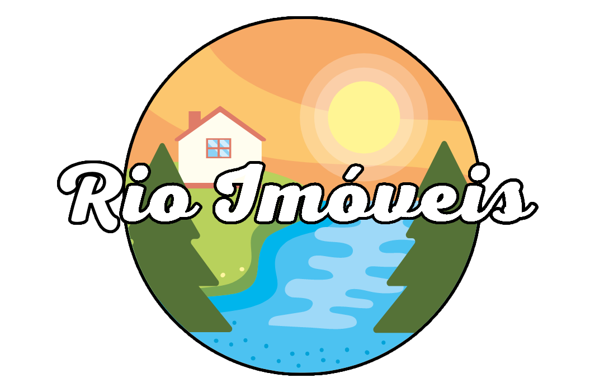
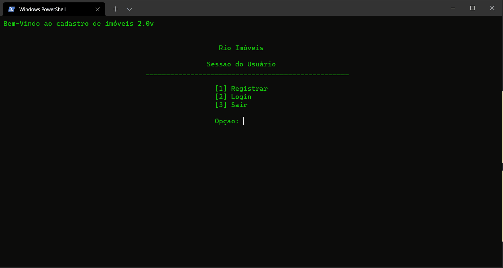

# :computer: Rio Imóveis' Estate/Property Management Program
<p>:brazil: Projeto feito no SENAI-SP em C, para conclusão de semestre.</p>
<p>:us: Project done at SENAI-SP in C, for semester conclusion.</p>



## Sobre - About
:brazil:
<p>O objetivo do projeto é facilitar o acesso a empresa e seus dados, para os funcionários, principalemnte aqueles que não possuem conhecimentos em sistemas de computação.</p>
<p><b>Ele faz o cadastro do local do imóvel comprado, irá listar todos os cadastros feitos e também pesquisa, para otimização de tempo para quem está fazendo o cadastro.</b></p>
<p><b><i>:part_alternation_mark: ATENÇÃO: </i></b>O projeto não possui nenhum sistema de banco de dados. Caso o programa seja fechado, todos os dados serão deletados (Apenas para teste).</p>

:us:
<p>The objective of the project is to facilitate the access to the company and its data, for the employees, especially those who do not have knowledge in computer systems.</p>
<p><b>It makes the registration of the location of the purchased property, will list all the registrations made and also search, for time optimization for who is making the registration.</b></p>
<p><b><i>:part_alternation_mark: WARNING: </i></b>The project does not have any database system. If the program is closed, all data will be deleted (test only).</p>

## Operação - Operation
:brazil:
<p>:dvd: <b>FUNÇÃO DE CADASTROS DE USUÁRIOS:</b> De inicio, um acesso anterior, para entrada de usuários. Primeiramente, deve ser feito um cadastro, para posteriormente gerar um login e entrar no sistema.</p>
<p>:balloon: <b>ELEMENTOS DO CADASTRO DE USUÁRIOS:</b></p>

* Endereço;
* CEP (Código Postal);
* Número do imóvel;
* Preço.

<p>:computer: <b>FUNÇÕES GERAIS: </b>No sistema principal, há funções como: cadastrar o imóvel, visualização dos cadastros, busca exata pelo cadastro, alteração de dados, exclusão de dados e saída do programa.</p>

<br>

:us:
<p>:dvd: <b>USER REGISTRATION FUNCTION:</b> At first, a previous access, for user entry. First, a registration must be made, to later generate a login and enter the system.</p>
<p>:balloon: <b>USER REGISTRATION DETAILS:</b></p>

* Address;
* Postal Code;
* Property number;
* Price.

<p>:computer: <b>GENERAL FUNCTIONS: </b>In the main system, there are functions such as: register the property, view the registrations, exact search for the registration, change data, delete data and exit the program.</p>

## Preview



## Baixar - Download

<p>:brazil: Para baixar, vá até <a href="https://github.com/doT-corp/estate_management/releases">releases</a>.</p>
<p>:us: To download, go to <a href="https://github.com/doT-corp/estate_management/releases">releases</a>.</p>

## Repositório Local - Local Repository

* Compilar & Executar // Compile & Run // GCC
```
cd estate_management
gcc cadastro.c -o cadastro
./cadastro
```

## :trophy: Mais Informações - More Information
<p>:brazil: Para mais informações do projeto, vá para a pasta "docs".</p>
<p>:us: For more project information, go to the "docs" folder.</p>
<p><i><b><a href="https://github.com/doT-corp/estate_management/tree/main/docs">DOCS</a></i></b></p>
